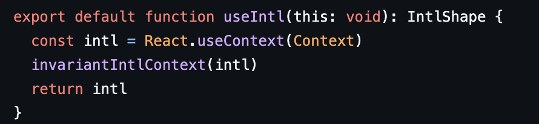

# 지역 상태, 전역 상태,

리액트 애플리케이션을 개발하다 보면 가장 먼저 마주치는 고민 중 하나는 **“이 상태를 어디에 두어야 할까?”** 입니다.  
상태를 어디에 두느냐에 따라 리렌더링이 달라지고, 협업 구조가 달라지며, 성능이 달라질 수 있습니다.

이 글에서는 다음 내용을 중심으로 리액트 상태 관리의 개념과 실전 전략을 정리합니다:

- 지역 상태 vs 전역 상태
- Context API의 한계와 개선
- 전역 상태 관리 도구 선택 기준
- 리렌더링 최적화 전략

## 1. 지역 상태란?

지역 상태는 해당 컴포넌트에서만 사용하는 상태입니다.  
`useState`, `useReducer`로 선언되며 컴포넌트의 UI와 긴밀히 연동됩니다.

```tsx
// 이 상태는 컴포넌트 내부에서만 관리되고, 다른 컴포넌트에는 영향을 주지 않습니다.

// 순수 함수형 컴포넌트와 달리, 내부 상태를 가지므로 "순수하지 않은 함수"로 간주됩니다.

const Counter = () => {
	const [count, setCount] = useState(0);
	return <button onClick={() => setCount(count + 1)}>{count}</button>;
};

/*
+) 리액트에서의 순수 컴포넌트
function Hello({ name }) {
  return <p>Hello, {name}</p>;
}
*/
```

하지만, 당연하게도 지역상태로만으로는 더 복잡한 서비스를 유지할 수 없습니다.

따라서 조금은 지역 상태에서 조금은 저항해봅시다.

## 2. 지역 상태의 한계: 상태 끌어올리기

여러 컴포넌트에서 같은 상태가 필요하다면, 공통 부모 컴포넌트로 상태를 끌어올리는 방식입니다.

```js
const Parent = () => {
	const [count, setCount] = useState(0);
	return (
		<>
			<Child1 count={count} setCount={setCount} />
			<Child2 count={count} setCount={setCount} />
		</>
	);
};
```

간단하지만 구조가 복잡해질수록 props drilling 문제가 발생합니다.
중간 컴포넌트는 상태를 직접 사용하지 않더라도 단지 "전달자" 역할만 하게 됩니다.

해당 문제를 극복하려면, 다른 개념을 적용해야만 합니다.

## 3. 전역 상태

전역 상태는 여러 컴포넌트가 동시에 접근하고 공유할 수 있는 상태입니다.
어디서든 접근 가능하며, 컴포넌트 계층 구조와는 무관하게 활용됩니다.

- props 전달이 복잡해질 때: 트리 깊이가 깊어질수록 props drilling이 심해짐
- 여러 컴포넌트에서 동일한 상태를 사용해야 할 때
- 리액트 외부의 상태를 관리할 때: 인증 정보, 브라우저 저장소 등

## 3-1. context 가 과연 문제덩어리기만 할까?

많은 글들에서 context 기반의 Provider를 사용하는것을 엄히 제어하기도 한다.

그 이유로는 context 의 value 에 구독하고 있는 정보가 아님에도, 하나의 값이 변동되었을때, 모든 useContext를 통해 구독하고 있는 값들이 제어당하기 때문,

그렇다면, 각기 다른 value 들을 각각의 provider를 통해서 관리하게 되면 어떨까? 성능상 이슈도 없으며,

실제로 대형 라이브러리인 react-intl 에서도 아래와 같이 사용하곤 한다.

(여기서 react-intl은 다국어 지원을 위한 라이브러리이다.)



## 정리

간단하게 지역상태와 전역상태, 그리고 context에 대한 내 생각을 약간 공유했다. 다음 장에서는 구체적으로 어떤 상태를 어떻게 사용해야 할지에 대해서 추가적으로 공유해보자.
